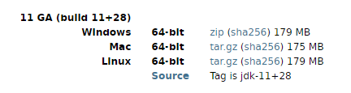
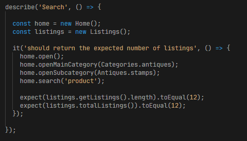
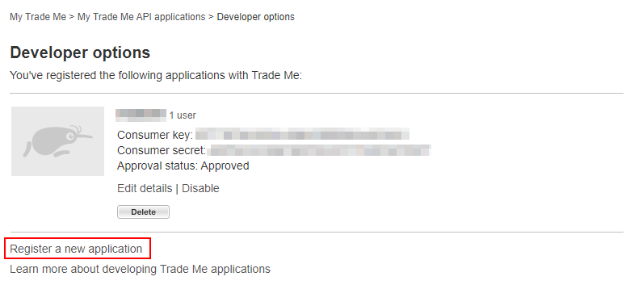
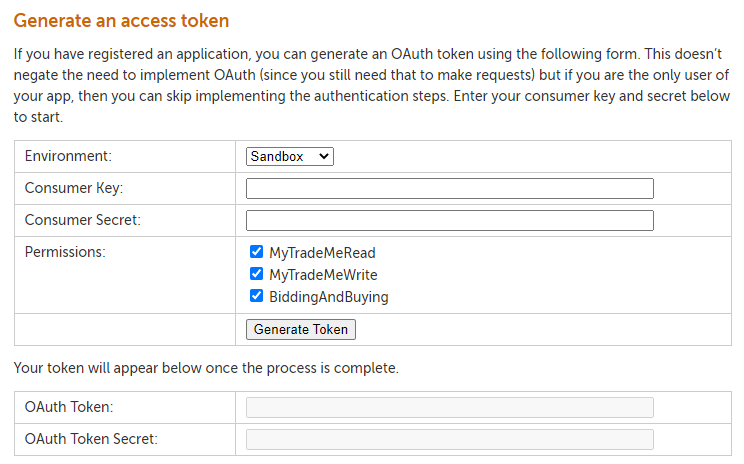
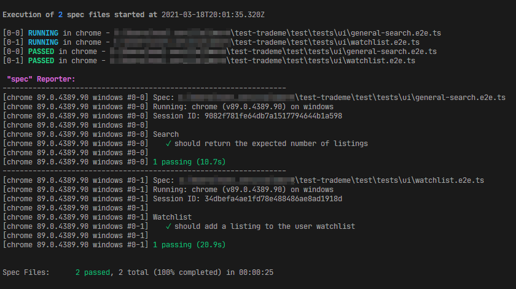
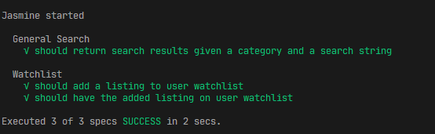

# Description
These are tests for Trade Me's website and services.

The tests are divided into two. A UI test suite that tests the [Trade Me website](https://www.tmsandbox.co.nz/), and an API test suite which test [Trade Me's services](https://developer.trademe.co.nz/api-overview/).

The tests runs on node and is written on Typescript. It uses [axios](https://axios-http.com/) as the http client for testing the services and [webdriverio](https://webdriver.io/) for the website. Both are using [Jasmine](https://jasmine.github.io/) for the test framework.

An Azure pipeline is setup to run these tests. It can be accessed from [here](https://dev.azure.com/noelsev/bahaykubo/_build?definitionId=4).

# Prerequisites

You will need to have [Node](https://nodejs.org/en/) installed (used v12.13.0) and able to run npm (used v6.12.0) commands. Run the commands shown here from bash or shell.

Webdriverio uses [selenium-standalone](https://www.npmjs.com/package/selenium-standalone) to run the browser tests, so [Java is required to be available](https://github.com/vvo/selenium-standalone/blob/HEAD/docs/java-versions.md) from your machine.

You can get the [JDK](https://jdk.java.net/archive/) from here, extract and add Java to your machine PATH. These tests were tested on JDK version 11.



Webdriverio is also using [webdriverio/sync](https://webdriver.io/docs/sync-vs-async/) which allows the tests to be written without the need for async/await.



This requires a C++ compiler to be available from your machine. [Choose either options here to install if not already on your machine](https://www.npmjs.com/package/node-gyp#option-1).

## Application Accounts and Tokens
----
You will need to have a user created on the Trade Me sandbox and have generated OAuth tokens for the user to run these. You will then use these information for the environment variables as instrctured on the Test section.


### Create New User
----
Please go **[here to register and create a new user](https://www.tmsandbox.co.nz/Members/Register.aspx)** **OR** register from the main page.


And once you have created a new user and logged in, go to the users' **[My Trade Me API Application](https://www.tmsandbox.co.nz/MyTradeMe/Api/MyApplications.aspx)** **OR** open it from My Trade Me


Go to Developer options and then register a new application. Once you have created a new application, you should see your application from 'Developer options' with a **Consumer key** and a **Consumer secret**. You will then use this to generate an access token for the API.




### Generate Access Token
----
To make Trade Me API calls, you will need to to be a Trade Me member and obtain an Oauth token. To create one for yourself, use the access token generator from the **[Trade Me developer site](https://developer.trademe.co.nz/api-overview/authentication/)**.



Provide the consumer key and secret to generate the oauth token and secret.

You will then use and add all these information to your environment variables.

# Setup
To set up the project, install the npm packages by running

```bash
npm ci
```

# Test
The tests involves logging in and providing authorisation tokens retreived from the environment variables. When running these tests from a build pipeline, add these to the pipeline environment variables.

To set this on your machine, you will need to add these environment variables with the corresponding value **OR** you can **use the two test commands provided below under the Run test section**.

```text
username=REPLACEWITHusername
testpassword=REPLACEWITHuserpassword
token=REPLACEWITHoauthtoken
tokensecret=REPLACEWITHoauthtokensecret
key=REPLACEWITHconsumerkey
keysecret=REPLACEWITHconsumersecret
```
## Run test
----

For running the ui tests, use:
```bash
npm run ui-test
```

**to include the required environment variables from the command line:**
```bash
username=**REPLACEWITHusername** testpassword=**REPLACEWITHuserpassword** token=**REPLACEWITHoauthtoken** tokensecret=**REPLACEWITHoauthtokensecret** key=**REPLACEWITHconsumerkey** keysecret=**REPLACEWITHconsumersecret** npm run ui-test
```



For running the api tests, use:
```bash
npm run api-test
```

**to include the required environment variables from the command line:**
```bash
username=**REPLACEWITHusername** testpassword=**REPLACEWITHuserpassword** token=**REPLACEWITHoauthtoken** tokensecret=**REPLACEWITHoauthtokensecret** key=**REPLACEWITHconsumerkey** keysecret=**REPLACEWITHconsumersecret** npm run api-test
```


